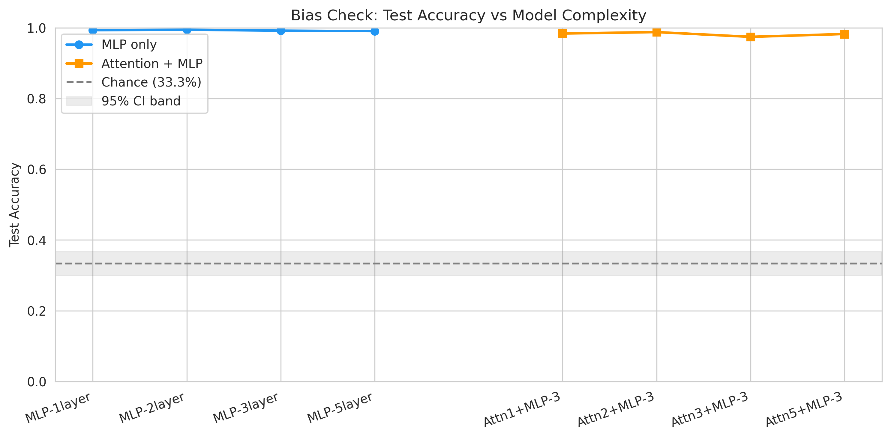
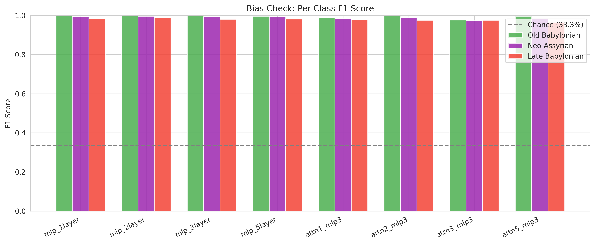
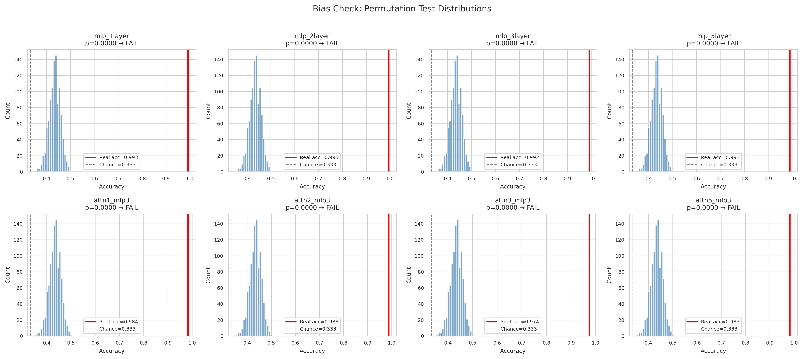
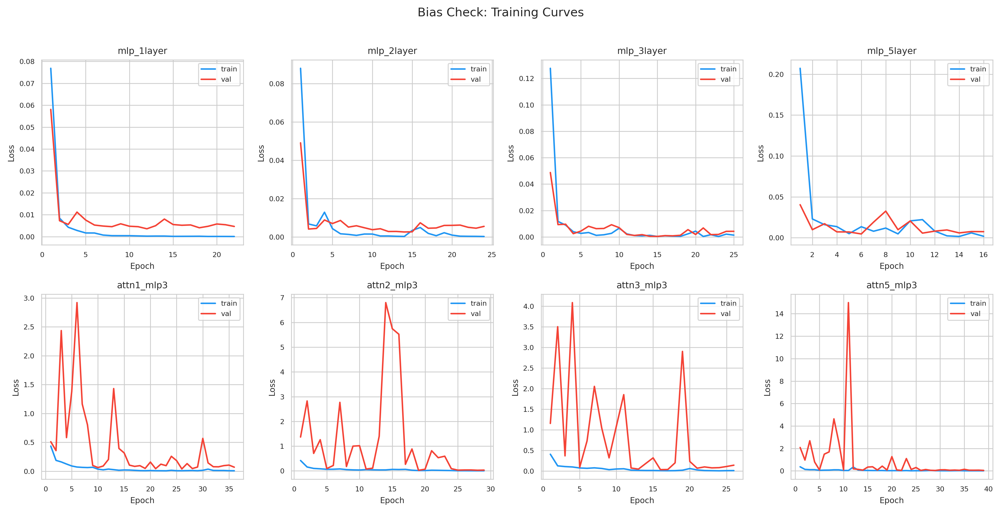
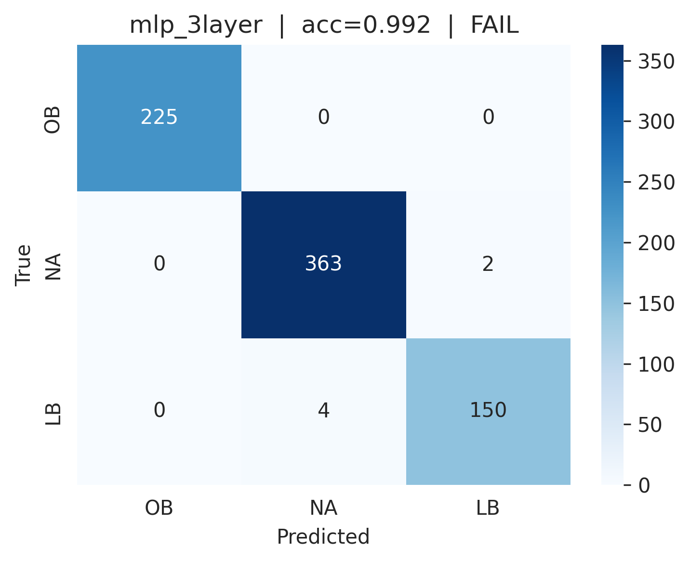
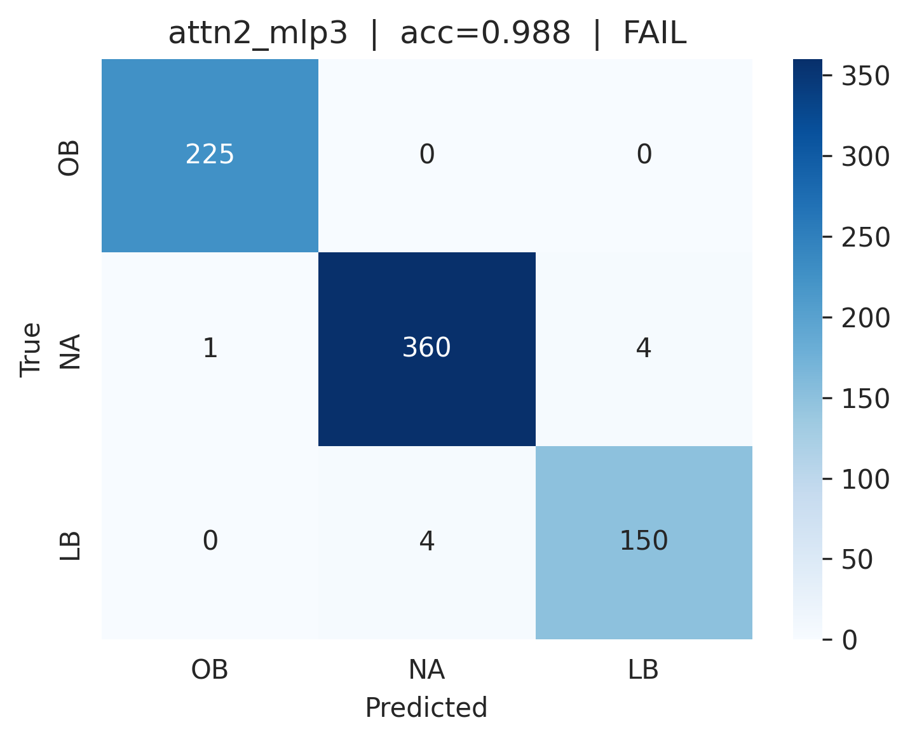
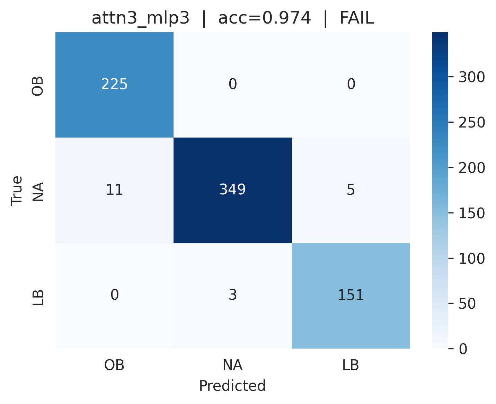

# Bias Check Report: Test Data Temporal Signal

**Generated**: 2026-03-19 14:35:41
**Overall verdict**: ❌ FAIL

---

## Context

Before running LLM evaluation (Track A), we verify that the test set carries no exploitable surface-level temporal signal. A simple classifier that can distinguish Old Babylonian / Neo-Assyrian / Late Babylonian texts from transliteration alone would indicate dataset bias.

Bias risks flagged by Chungrong: orthography, morphology, geographical/deity names, and provenance markers.

---

## Dataset

- **Total test samples**: 744
- **Total train samples**: 3,469
- **Labels**: Old Babylonian, Neo-Assyrian, Late Babylonian

---

## Methodology

**Features**: TF-IDF char n-grams, analyzer=`char_wb`, n-gram range (2,5), max 10,000 features, sublinear TF. Fit on train only.

**Models**: 8 variants — MLP depth sweep (1→5 layers) and attention+MLP sweep (1→5 attention blocks, fixed 3-layer MLP head).

**Permutation testing** (Ojala & Garriga, JMLR 2010): 1000 permutations of train labels, SGDClassifier (log loss) as proxy estimator. p-value = fraction of permuted runs ≥ real accuracy.

**Significance thresholds**: FAIL p<0.01, WARN p<0.05, PASS p≥0.05

**Note on multiple comparisons**: 8 models are tested without Bonferroni correction. Under H₀, ~0.4 false positives are expected at α=0.05. The conservative overall verdict (any FAIL → FAIL) partially compensates.

---

## Baselines

| Baseline | Accuracy |
|----------|----------|
| Chance (uniform random) | 33.3% |
| Majority class (observed) | 49.1% |
| Binomial 95% CI half-width | ±3.4% |

---

## Results Summary

| Model | Accuracy | F1 Macro | p-value | Verdict |
|-------|----------|----------|---------|---------|
| mlp_1layer | 0.993 | 0.992 | 0.0000 | ❌ FAIL |
| mlp_2layer | 0.995 | 0.994 | 0.0000 | ❌ FAIL |
| mlp_3layer | 0.992 | 0.991 | 0.0000 | ❌ FAIL |
| mlp_5layer | 0.991 | 0.989 | 0.0000 | ❌ FAIL |
| attn1_mlp3 | 0.984 | 0.983 | 0.0000 | ❌ FAIL |
| attn2_mlp3 | 0.988 | 0.986 | 0.0000 | ❌ FAIL |
| attn3_mlp3 | 0.974 | 0.975 | 0.0000 | ❌ FAIL |
| attn5_mlp3 | 0.983 | 0.981 | 0.0000 | ❌ FAIL |

---

## Plots


*Test accuracy vs model complexity*


*Per-class F1 scores*


*Permutation test distributions*


*Training curves (loss)*


---

## Per-Model Details

### mlp_1layer  ❌ FAIL

- Accuracy: **0.993**
- F1 macro: 0.992  |  F1 weighted: 0.993
- Precision macro: 0.992  |  Recall macro: 0.993
- Permutation p-value: 0.0000 (n=1000)

| Class | Precision | Recall | F1 | Support |
|-------|-----------|--------|----|---------|
| Old Babylonian | 1.000 | 1.000 | 1.000 | 225 |
| Neo-Assyrian | 0.995 | 0.992 | 0.993 | 365 |
| Late Babylonian | 0.981 | 0.987 | 0.984 | 154 |

**Confusion matrix** (rows=true, cols=predicted):

```
                      OB      NA      LB  (predicted)
Old Babylonian       225       0       0
Neo-Assyrian           0     362       3
Late Babylonian        0       2     152
```


### mlp_2layer  ❌ FAIL

- Accuracy: **0.995**
- F1 macro: 0.994  |  F1 weighted: 0.995
- Precision macro: 0.993  |  Recall macro: 0.995
- Permutation p-value: 0.0000 (n=1000)

| Class | Precision | Recall | F1 | Support |
|-------|-----------|--------|----|---------|
| Old Babylonian | 1.000 | 1.000 | 1.000 | 225 |
| Neo-Assyrian | 0.997 | 0.992 | 0.995 | 365 |
| Late Babylonian | 0.981 | 0.994 | 0.987 | 154 |

**Confusion matrix** (rows=true, cols=predicted):

```
                      OB      NA      LB  (predicted)
Old Babylonian       225       0       0
Neo-Assyrian           0     362       3
Late Babylonian        0       1     153
```


### mlp_3layer  ❌ FAIL

- Accuracy: **0.992**
- F1 macro: 0.991  |  F1 weighted: 0.992
- Precision macro: 0.992  |  Recall macro: 0.990
- Permutation p-value: 0.0000 (n=1000)

| Class | Precision | Recall | F1 | Support |
|-------|-----------|--------|----|---------|
| Old Babylonian | 1.000 | 1.000 | 1.000 | 225 |
| Neo-Assyrian | 0.989 | 0.995 | 0.992 | 365 |
| Late Babylonian | 0.987 | 0.974 | 0.980 | 154 |

**Confusion matrix** (rows=true, cols=predicted):

```
                      OB      NA      LB  (predicted)
Old Babylonian       225       0       0
Neo-Assyrian           0     363       2
Late Babylonian        0       4     150
```



### mlp_5layer  ❌ FAIL

- Accuracy: **0.991**
- F1 macro: 0.989  |  F1 weighted: 0.991
- Precision macro: 0.988  |  Recall macro: 0.991
- Permutation p-value: 0.0000 (n=1000)

| Class | Precision | Recall | F1 | Support |
|-------|-----------|--------|----|---------|
| Old Babylonian | 0.991 | 1.000 | 0.996 | 225 |
| Neo-Assyrian | 0.997 | 0.986 | 0.992 | 365 |
| Late Babylonian | 0.974 | 0.987 | 0.981 | 154 |

**Confusion matrix** (rows=true, cols=predicted):

```
                      OB      NA      LB  (predicted)
Old Babylonian       225       0       0
Neo-Assyrian           1     360       4
Late Babylonian        1       1     152
```


### attn1_mlp3  ❌ FAIL

- Accuracy: **0.984**
- F1 macro: 0.983  |  F1 weighted: 0.984
- Precision macro: 0.983  |  Recall macro: 0.984
- Permutation p-value: 0.0000 (n=1000)

| Class | Precision | Recall | F1 | Support |
|-------|-----------|--------|----|---------|
| Old Babylonian | 0.978 | 1.000 | 0.989 | 225 |
| Neo-Assyrian | 0.989 | 0.978 | 0.983 | 365 |
| Late Babylonian | 0.980 | 0.974 | 0.977 | 154 |

**Confusion matrix** (rows=true, cols=predicted):

```
                      OB      NA      LB  (predicted)
Old Babylonian       225       0       0
Neo-Assyrian           5     357       3
Late Babylonian        0       4     150
```


### attn2_mlp3  ❌ FAIL

- Accuracy: **0.988**
- F1 macro: 0.986  |  F1 weighted: 0.988
- Precision macro: 0.986  |  Recall macro: 0.987
- Permutation p-value: 0.0000 (n=1000)

| Class | Precision | Recall | F1 | Support |
|-------|-----------|--------|----|---------|
| Old Babylonian | 0.996 | 1.000 | 0.998 | 225 |
| Neo-Assyrian | 0.989 | 0.986 | 0.988 | 365 |
| Late Babylonian | 0.974 | 0.974 | 0.974 | 154 |

**Confusion matrix** (rows=true, cols=predicted):

```
                      OB      NA      LB  (predicted)
Old Babylonian       225       0       0
Neo-Assyrian           1     360       4
Late Babylonian        0       4     150
```



### attn3_mlp3  ❌ FAIL

- Accuracy: **0.974**
- F1 macro: 0.975  |  F1 weighted: 0.974
- Precision macro: 0.971  |  Recall macro: 0.979
- Permutation p-value: 0.0000 (n=1000)

| Class | Precision | Recall | F1 | Support |
|-------|-----------|--------|----|---------|
| Old Babylonian | 0.953 | 1.000 | 0.976 | 225 |
| Neo-Assyrian | 0.991 | 0.956 | 0.974 | 365 |
| Late Babylonian | 0.968 | 0.981 | 0.974 | 154 |

**Confusion matrix** (rows=true, cols=predicted):

```
                      OB      NA      LB  (predicted)
Old Babylonian       225       0       0
Neo-Assyrian          11     349       5
Late Babylonian        0       3     151
```



### attn5_mlp3  ❌ FAIL

- Accuracy: **0.983**
- F1 macro: 0.981  |  F1 weighted: 0.983
- Precision macro: 0.978  |  Recall macro: 0.983
- Permutation p-value: 0.0000 (n=1000)

| Class | Precision | Recall | F1 | Support |
|-------|-----------|--------|----|---------|
| Old Babylonian | 0.991 | 1.000 | 0.996 | 225 |
| Neo-Assyrian | 0.989 | 0.975 | 0.982 | 365 |
| Late Babylonian | 0.955 | 0.974 | 0.965 | 154 |

**Confusion matrix** (rows=true, cols=predicted):

```
                      OB      NA      LB  (predicted)
Old Babylonian       225       0       0
Neo-Assyrian           2     356       7
Late Babylonian        0       4     150
```


---

## Overall Verdict and Recommendation

**Verdict: ❌ FAIL**

Statistically significant temporal signal detected (at least one model has p < 0.01). The transliteration features contain exploitable bias that a classifier can leverage. The benchmark may not reliably measure LLM knowledge vs. surface pattern matching. 

**Recommendation**: Halt Track A evaluation. Investigate the source of bias (orthography, morphology, names, provenance markers). Consider text preprocessing to remove known bias signals, or report the bias as a limitation with controlled experiments.
