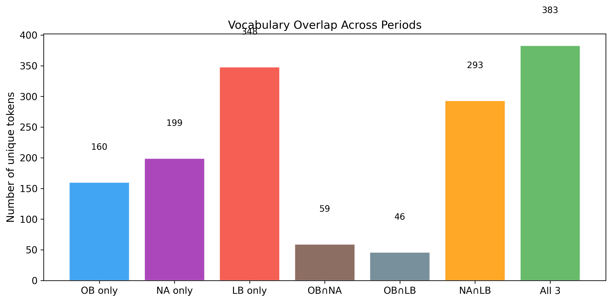
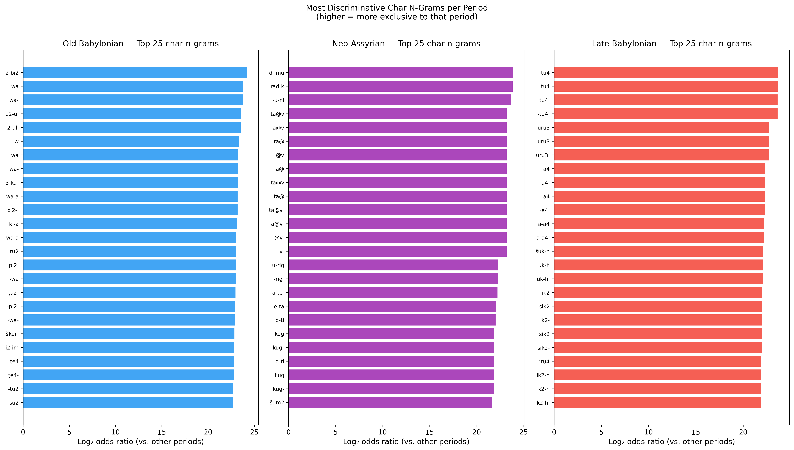
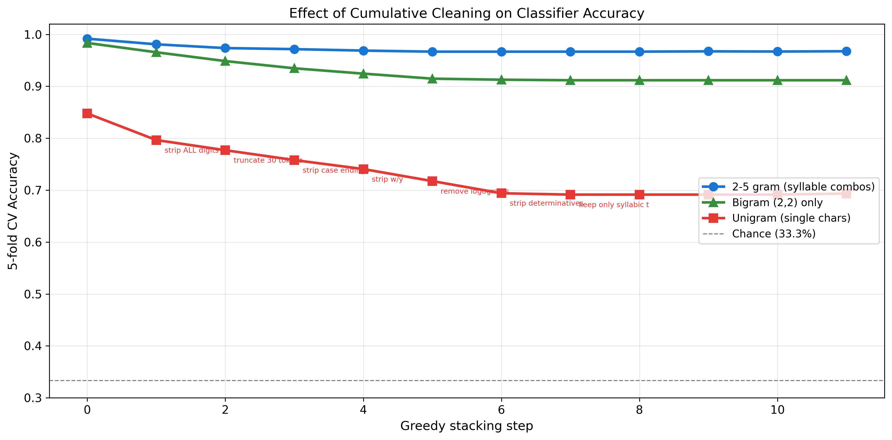
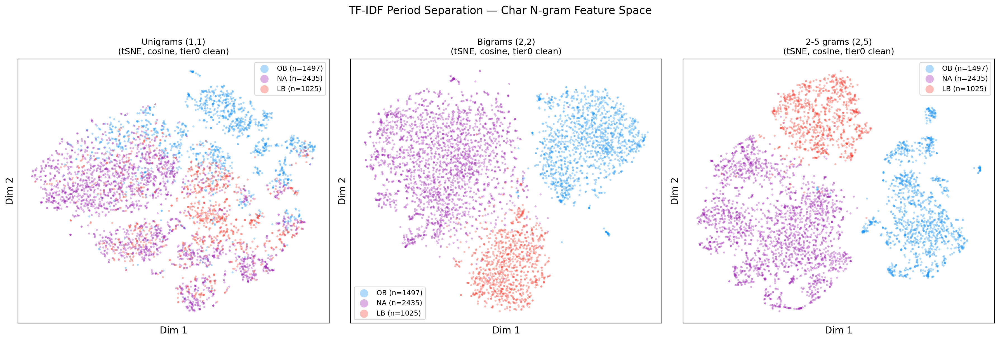
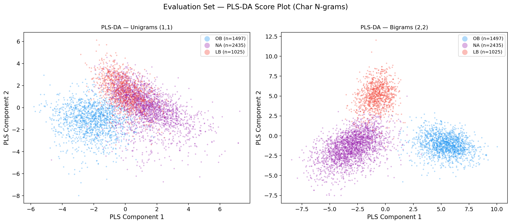
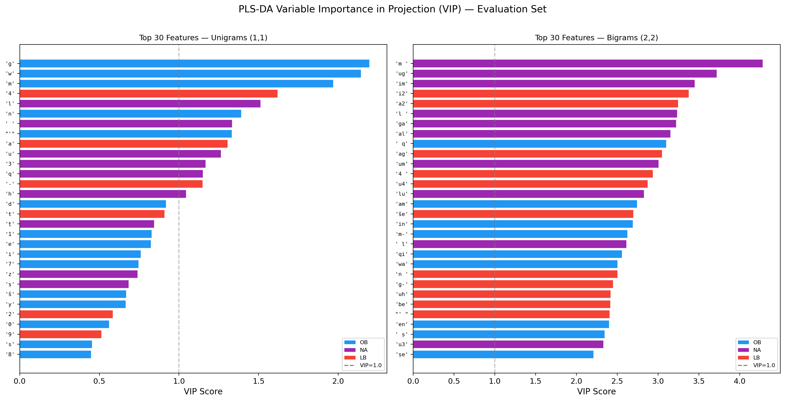
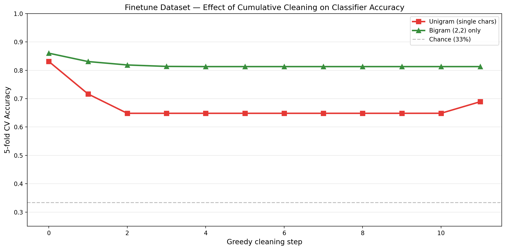
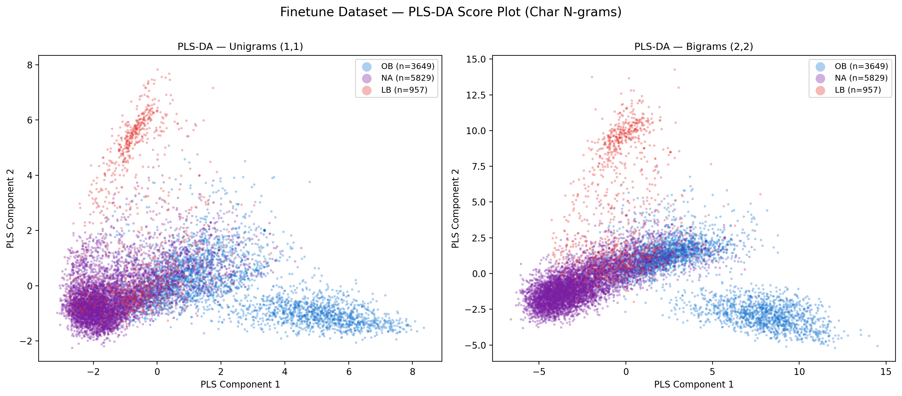
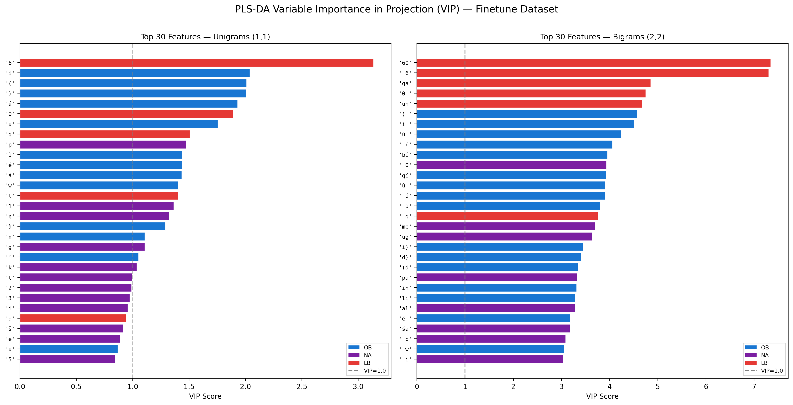
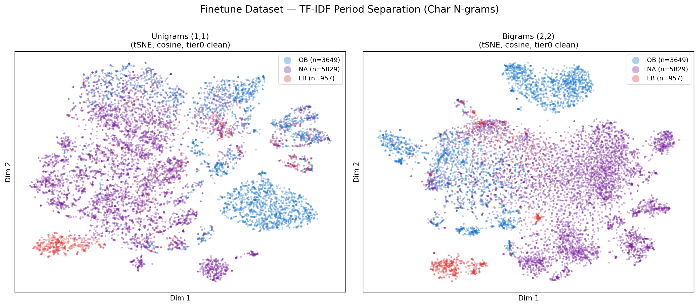

# Pre-Track A Bias Check: Summary for Supervisor

## Motivation

Before running LLM evaluation (Track A — "can an LLM date Akkadian texts?"), we must verify that period labels are not trivially recoverable from surface features alone. If a simple classifier can distinguish Old Babylonian (OB) / Neo-Assyrian (NA) / Late Babylonian (LB) from raw transliteration, an LLM could score well by pattern-matching rather than understanding.

---

## Dataset

| | Count |
|---|---|
| Total texts | 4,957 (all letters) |
| Old Babylonian (OB) | 1,497 |
| Neo-Assyrian (NA) | 2,435 |
| Late Babylonian (LB) | 1,025 |

Each period comes from a single corpus source: archibab -> OB, oracc -> NA, lbl -> LB (zero overlap).

---

## Experiment 1 — The Bias Check (HPC cluster)

**Setup:** TF-IDF character n-grams (2-5 grams, 10,000 features). 8 neural classifiers (4 MLPs with 1-5 layers, 4 Attention+MLP hybrids). Train/val/test split: 70/15/15, stratified. Permutation test: 1,000 shuffles.

**Result: FAIL.** All 8 models scored 97-99% accuracy (chance = 33%), all p = 0.000.

| Model | Accuracy | F1 Macro |
|---|---|---|
| MLP 1-layer | 99.3% | 0.992 |
| MLP 2-layer | 99.5% | 0.994 |
| MLP 3-layer | 99.2% | 0.991 |
| MLP 5-layer | 99.1% | 0.989 |
| Attn1+MLP3 | 98.4% | 0.983 |
| Attn2+MLP3 | 98.8% | 0.986 |
| Attn3+MLP3 | 97.4% | 0.975 |
| Attn5+MLP3 | 98.3% | 0.981 |

*Training and validation loss for all 8 models. The MLP family (top row) converges cleanly to near-zero loss within ~10 epochs with train and val tracking closely — no overfitting, the task is simply easy. The Attention+MLP models (bottom row) show noisier val curves but still converge, confirming the result is not an artifact of early stopping. All models reach the same end-point: a task so separable it is learned almost immediately.*

*For each of the 8 models: the blue histogram is accuracy under 1,000 random label shuffles (centered near chance, ~33–50%), and the red vertical line is the real accuracy. In every panel the real accuracy is completely separated from the null distribution — p = 0.000 for all models. This is the formal statistical proof of FAIL.*

---

## Experiment 2 — Ablation: Can We Clean Out the Signal?

**Setup:** Logistic regression with 5-fold cross-validation on all 4,957 texts. We applied 11 text-cleaning filters, first individually and then stacked greedily (each step adds the filter that drops accuracy the most).

*Each period has a large block of period-exclusive tokens (OB=160, NA=199, LB=348) and only 383 tokens are shared by all three. This means simply restricting to shared vocabulary cannot eliminate the signal — as confirmed by the ablation, where even the 383 shared tokens yield 98.5% accuracy (with wildly different frequency distributions across periods).*

### What We Tested and Why

| Filter | What it removes | Evidence from analysis |
|---|---|---|
| tier0 baseline | ORACC markup (`@v`) and encoding artifacts (`\xa0`, `ₓ`) | `@v` appears 968 times in NA, zero in OB/LB — pure corpus artifact |
| normalize long vowels | Macron vowels (ā ī ū ē) | Zero occurrences in entire dataset — no effect |
| lowercase | Upper/lower distinction | Logogram ratio: OB=25.7%, NA=44.0%, LB=52.0% |
| strip determinatives | Semantic-classifier prefixes (lu2-, I-, d-, uru-) | lu2- is 18x more frequent in NA than OB; I- is 7x more in LB |
| strip w and y | West Semitic consonants exclusive to OB | w: 1,345 occurrences in OB, zero in NA/LB (phoneme lost after OB) |
| strip -meš | Sumerian plural suffix | Usage: OB=0.9/text, NA=2.4, LB=1.8 |
| strip case endings | Akkadian grammatical endings (-am, -im, -um) | OB ventive: -am at 2.77/text in OB vs 0.10 in NA (28x ratio) |
| strip ALL digits | Subscript numbers and all digits | Same sign read ša in OB but ša2 in LB; rate_4 is #1 important feature |
| truncate to N tokens | Text beyond first N words | Length differs: OB median=39 words, NA=40, LB=53 |
| remove ALL logograms | All uppercase tokens (Sumerian words) | Logogram rate: OB=25.7% vs LB=52.0% (2x ratio) |
| keep only syllabic | Everything except lowercase phonetic Akkadian | Combines logogram + determinative + uppercase removal |

*Top 25 character n-grams by log-odds ratio for each period (higher = more exclusive to that period). OB is dominated by `w`- and `wa`-containing sequences (the West Semitic /w/ phoneme, phonologically absent in NA and LB). NA's top features are almost entirely `@v` ORACC markup — a pure corpus artifact. LB is dominated by subscript-4 sequences (`tu4`, `ša2`, `uru3`) reflecting its distinctive sign-reading conventions. The NA column also shows that once `@v` is removed, genuine NA markers (discourse particles, determinatives) surface.*

---

### Table 1 — Individual Filters (each tested alone), char 2-5 grams

| Filter | Example | Accuracy | Drop |
|---|---|---|---|
| tier0 baseline | TA@v -> TA | 99.2% | — |
| normalize long vowels | ūmī -> umi | 99.2% | 0.0 |
| lowercase | ARAD -> arad | 99.2% | 0.0 |
| strip determinatives | lu2-ARAD -> ARAD | 99.2% | 0.0 |
| strip w and y | a-wa-rum -> a-a-rum | 99.2% | 0.0 |
| strip -meš plural | ARAD-meš -> ARAD | 99.2% | 0.0 |
| strip case endings | al-tim -> al | 99.1% | -0.1 |
| strip ALL digits | ša2 -> ša | 99.0% | -0.2 |
| truncate to 30 tokens | word31... -> removed | 98.7% | -0.4 |
| remove ALL logograms | ARAD -> removed | 98.4% | -0.8 |
| keep only syllabic | LUGAL -> removed | 98.1% | -1.1 |
| truncate to 10 tokens | word11... -> removed | 97.4% | -1.8 |

**Nothing individually drops accuracy below 97%.**

---

### Table 2 — Greedy Stacking, char 2-5 grams

| Step | Filter added | Acc | Total drop |
|---|---|---|---|
| 0 | tier0 baseline | 99.2% | — |
| 1 | + keep only syllabic | 98.1% | -1.1 |
| 2 | + truncate 30 tokens | 97.4% | -1.8 |
| 3 | + strip determinatives | 97.2% | -2.0 |
| 4 | + strip subscript digits | 96.9% | -2.3 |
| 5 | + strip case endings | 96.7% | -2.5 |
| 6-11 | + all remaining filters | 96.7% | -2.5 |

**After stacking every possible cleaning step: 96.7%.** Only 2.5 percentage points lost.

---

### Table 3 — Greedy Stacking, char unigrams only

Unigrams are the harshest test: the classifier sees only single-character frequencies, no morphological patterns.

| Step | Filter added | Acc | Total drop | Chars left |
|---|---|---|---|---|
| 0 | tier0 baseline | 84.8% | — | 41 |
| 1 | + strip ALL digits | 79.6% | -5.1 | 31 |
| 2 | + truncate 30 tokens | 77.7% | -7.1 | 31 |
| 3 | + strip case endings | 75.8% | -9.0 | 31 |
| 4 | + strip w and y | 74.1% | -10.7 | 31 |
| 5 | + remove logograms | 71.7% | -13.0 | 28 |
| 6 | + strip determinatives | 69.4% | -15.4 | 28 |
| 7-11 | + all remaining | 69.1% | -15.7 | 26 |

Even single-character frequencies alone, after maximal cleaning, yield 69% (chance = 33%).

---

### Table 4 — Greedy Stacking, char bigrams (2,2) only

| Step | Filter added | Acc | Total drop |
|---|---|---|---|
| 0 | tier0 baseline | 98.3% | — |
| 1 | + keep only syllabic | 96.6% | -1.8 |
| 2 | + strip ALL digits | 94.9% | -3.5 |
| 3 | + truncate 30 tokens | 93.5% | -4.9 |
| 4 | + strip case endings | 92.4% | -5.9 |
| 5 | + strip determinatives | 91.5% | -6.9 |
| 6 | + strip w/y | 91.3% | -7.1 |
| 7-11 | + all remaining | 91.2% | -7.2 |

---

### Summary Across N-gram Modes

| N-gram range | Baseline | After full cleaning | Total drop |
|---|---|---|---|
| 2-5 grams | 99.2% | 96.7% | -2.5 pts |
| Bigrams (2,2) | 98.3% | 91.2% | -7.2 pts |
| Unigrams (1,1) | 84.8% | 69.1% | -15.7 pts |

Longer n-grams are more robust to cleaning because they capture morphological and syllabic patterns that are genuine linguistic features.

*The three curves show greedy-stacked cleaning for 2-5 grams (blue), bigrams (green), and unigrams (red). Each step on the x-axis adds the next most effective filter. All three curves decline slowly and plateau well above chance (33%, dashed line). The 2-5 gram curve barely moves (-2.5 pts total); unigrams are most sensitive but still floor at 69%. No cleaning combination breaks the period signal.*

---

## Key Linguistic Features Driving Separation

These are real diachronic differences, not corpus artifacts:

| Feature | OB | NA | LB | Type |
|---|---|---|---|---|
| w consonant | 1,345 occ. | 0 | 0 | Phonological (West Semitic /w/ lost after OB) |
| Ventive -am | 2.77/text | 0.10/text | — | Morphological (OB case ending) |
| Ventive -im | 2.30/text | 0.05/text | — | Morphological (46x ratio) |
| ma-a quotative | rare | high-freq | rare | Discourse marker (NA-exclusive) |
| lu2- determinative | 0.1/text | 1.8/text | — | Convention (18x ratio) |
| I- name prefix | 0.6/text | — | 3.9/text | Onomastic (7x ratio) |
| Logogram rate | 25.7% | 44.0% | 52.0% | Writing system preference |
| Subscript conventions | ša | ša | ša2 | Editorial (same sign, different reading) |

*t-SNE projection of TF-IDF char n-gram features (cosine distance, after tier0 cleaning) for all 4,957 texts, shown for unigrams, bigrams, and 2-5 grams. Even at the unigram level (single characters), OB (blue), NA (purple), and LB (red) form largely separate clusters. By 2-5 grams the three periods are almost completely linearly separable. This is a bag-of-characters model — no word boundaries, no syntax — yet period separates cleanly, confirming the signal is deep in the character statistics of each language stage.*

Only one feature was a pure corpus artifact: `@v` ORACC markup (968 occurrences in NA, zero elsewhere). Removing it had zero effect on accuracy.

---

## Experiment 2b — PLS-DA on Evaluation Set: Feature Interpretability

To understand *which specific surface features* drive period separation in the evaluation set, we ran PLS-DA (Partial Least Squares Discriminant Analysis) with VIP scores (Variable Importance in Projection, Wold 1993). This mirrors the analysis later done on the finetune dataset (Experiment 3d), allowing direct cross-dataset comparison.

**Setup:** Same 4,957 evaluation-set letters, tier0 cleaning, TF-IDF char n-grams (`char_wb`, `max_features=10000`, `sublinear_tf=True`). PLS with 2 latent components (maximum useful for a 3-class problem). Run separately for unigrams (1,1) and bigrams (2,2).

### Top VIP features — Evaluation Set, Unigrams (1,1)

| Rank | Feature | VIP | Period | Linguistic interpretation |
|---|---|---|---|---|
| 1 | `g` | 2.20 | OB | High frequency in OB syllabic writing (ga, gi, gu syllables) |
| 2 | `w` | 2.14 | OB | West Semitic /w/ — phonologically exclusive to OB |
| 3 | `m` | 1.97 | OB | Dominant in OB morphological endings (-am, -im, -um) |
| 4 | `4` | 1.62 | LB | Subscript-4 digit (u4 "day", tu4 etc.) — LB sign-reading convention |
| 5 | `l` | 1.51 | NA | Frequent in NA formulaic vocabulary |
| 6 | `n` | 1.39 | OB | Common in OB syllables |
| 11 | `3` | 1.17 | NA | Subscript-3 sequences — NA scribal convention |
| 12 | `q` | 1.15 | NA | /q/ consonant |
| 14 | `h` | 1.04 | NA | Reflecting NA phonological preferences |

Features with VIP > 1.0: **14 / 41** characters.

### Top VIP features — Evaluation Set, Bigrams (2,2)

| Rank | Feature | VIP | Period | Linguistic interpretation |
|---|---|---|---|---|
| 1 | `m ` | 4.28 | NA | Word-final `m` — ubiquitous in NA formulaic phrases |
| 2 | `ug` | 3.72 | NA | Common NA syllable cluster |
| 3 | `im` | 3.45 | NA | Genitive ending `-im` — morphological marker |
| 4 | `i2` | 3.38 | LB | Subscript-2 sequences — LB sign-reading convention |
| 5 | `a2` | 3.24 | LB | Subscript-2 sequences — LB |
| 7 | `ga` | 3.22 | NA | NA syllabic pattern |
| 8 | `al` | 3.15 | NA | Common in NA words (e.g. *šalāmu* "to be well") |
| 9 | ` q` | 3.10 | OB | Word-initial /q/ — OB vocabulary |
| 11 | `um` | 3.01 | NA | Nominative ending `-um` — more frequent in NA letters |
| 12 | `4 ` / `u4` | ~2.9 | LB | Subscript-4, word-boundary patterns — LB |
| 14 | `lu` | 2.83 | NA | From `lu2-` determinative, 18x more frequent in NA |
| 15 | `am` | 2.74 | OB | Ventive ending `-am` — 28x more frequent in OB |
| 21 | `wa` | 2.51 | OB | /wa/ syllable — the /w/ phoneme again |

Features with VIP > 1.0: **119 / 533** bigrams.

*PLS-DA score plot for the 4,957 evaluation-set letters. OB (blue), NA (purple), LB (red) form distinct clusters in latent space for both n-gram modes. Separation is clean, especially for bigrams.*

*Top 30 features by VIP score for unigrams (left) and bigrams (right), colored by the period each feature most discriminates. The /w/ phoneme, subscript digits, and morphological endings dominate.*

### Cross-Dataset Comparison: Evaluation Set vs Finetune

| Feature tier | Eval set top features | Finetune top features | Consistent? |
|---|---|---|---|
| **Subscript digits (LB)** | `4`, `i2`, `a2`, `u4` (subscript-4/2) | `6`, `60`, ` 6` (subscript-6) | ✓ Same tier, different specific digits — genre difference (letters use subscript-4; divination/admin texts use subscript-6) |
| **/w/ phoneme (OB)** | `w` rank 2 (VIP 2.14), `wa` rank 21 | `w` rank 5 (VIP 1.41) | ✓ Both datasets — consistent OB discriminator |
| **Morphological endings (OB/NA)** | `im`, `um`, `am`, `m ` dominate bigrams | `un`, `bí`, `lí` for OB | ✓ Morphology drives bigrams in both; eval set more formulaic (letters-only) so NA endings more prominent |
| **/q/ consonant** | `q` rank 12 (NA in eval) | `q` rank 6 (LB in finetune) | ~ Same feature, period assignment flips — reflects genre mix in finetune |
| **Logogram/uppercase** | Less prominent at char level | `(`, `)` notation for OB | Partial — logograms appear more in ablation than VIP for eval set |

**Key observation:** The eval set bigrams are dominated by **NA morphological endings** (`im`, `um`, `am`, `m `, `lu`) — this is because the eval set is letters-only, and NA administrative letters have highly stereotyped formulaic openings and closings. The finetune data spreads across genres, diluting any single formula. But the underlying features are the same three linguistic tiers: writing system conventions, phonology (/w/), and morphology (case endings).

---

## Experiment 3 — Replication on Full Finetune Dataset

Experiments 1–2 used only the 4,957-text evaluation set (curated letters). To confirm the signal is not an artifact of that particular corpus, we replicated the analysis on the **full finetune dataset** — a broader, mixed-genre collection at fragment level.

### Finetune Dataset Construction

| | Evaluation set | Finetune set |
|---|---|---|
| Granularity | Full texts (letters) | Fragments (token-level chunks) |
| Total rows | 4,957 | 40,429 (10,435 usable) |
| Genre | Letters only | Mixed (divination, medicine, admin, letters, etc.) |
| Period labels | Direct from corpus_source | Derived via CDLI metadata join |

**Period labels:** archibab → OB (always). ORACC → joined with CDLI catalog (`oracc_cdli_metadata.parquet`) to obtain period, then mapped: "Old Babylonian" → OB, "Neo-Assyrian" → NA, "Neo-Babylonian/Achaemenid/Hellenistic" → LB.

| Period | Fragments | Signs |
|---|---|---|
| OB | 3,649 | 349,788 |
| NA | 5,829 | 904,193 |
| LB | 957 | 136,538 |
| **Total usable** | **10,435** | **1,390,519** |

**Dropped (29,994 fragments, 71.6%):**
- eBL: 24,909 fragments — no period metadata exists in the eBL corpus
- ORACC without CDLI match: 3,569 fragments — fragment_id not found in CDLI catalog
- ORACC other periods: 1,516 fragments — periods outside OB/NA/LB (Uruk III, Middle Babylonian, ED IIIa, etc.)

---

### 3a. TF-IDF + Logistic Regression (5-fold CV)

Same setup as Experiment 2: TF-IDF char n-grams (`char_wb`, `max_features=10000`, `sublinear_tf=True`), logistic regression, 5-fold CV. Tier0 cleaning applied.

| N-gram | Accuracy | F1 Macro |
|---|---|---|
| Unigrams (1,1) | 83.1% ± 12.9% | 0.766 ± 0.150 |
| Bigrams (2,2) | 86.0% ± 11.6% | 0.803 ± 0.135 |

Higher variance than the evaluation set reflects shorter fragments (median 35 signs), class imbalance (LB has only 957 fragments), and genre diversity.

---

### 3b. Greedy Cleaning Ablation on Finetune Data

Same 11 cleaning filters, same greedy stacking procedure.

#### Table 5 — Greedy Stacking on Finetune Data, char unigrams (1,1)

| Step | Filter added | Acc | Incremental Δ | Total drop |
|---|---|---|---|---|
| 0 | tier0 baseline | 83.1% | — | — |
| 1 | + keep only syllabic | 71.6% | **-11.5** | -11.5 |
| 2 | + strip w/y | 64.8% | **-6.8** | -18.3 |
| 3-11 | + all remaining filters | 64.8% | 0.0 | -18.3 |

#### Table 6 — Greedy Stacking on Finetune Data, char bigrams (2,2)

| Step | Filter added | Acc | Incremental Δ | Total drop |
|---|---|---|---|---|
| 0 | tier0 baseline | 86.0% | — | — |
| 1 | + keep only syllabic | 83.1% | **-2.9** | -2.9 |
| 2 | + truncate 30 tokens | 81.9% | -1.2 | -4.1 |
| 3 | + strip w/y | 81.4% | -0.5 | -4.7 |
| 4 | + normalize long vowels | 81.3% | -0.1 | -4.7 |
| 5-11 | + all remaining filters | 81.3% | 0.0 | -4.7 |

*Greedy-stacked cleaning on the finetune dataset for bigrams (green) and unigrams (red). Both curves plateau well above chance (33%). The finetune unigram curve is steeper than the evaluation set (two filters account for all the drop), but the floor is comparable (64.8% vs 69.1%).*

---

### 3c. Comparison: Evaluation Set vs Finetune — Incremental Filter Effects

The table below shows the **incremental** accuracy drop of each cleaning step (i.e., the drop caused by *that specific filter*, not cumulative from baseline).

#### Unigrams (1,1) — Incremental Δ per Step

| Step | Eval Set filter | Eval Δ | Finetune filter | FT Δ |
|---|---|---|---|---|
| 1 | strip ALL digits | -5.1 | keep only syllabic | **-11.5** |
| 2 | truncate 30 tokens | -2.0 | strip w/y | **-6.8** |
| 3 | strip case endings | -1.9 | (plateau) | 0.0 |
| 4 | strip w/y | -1.7 | | |
| 5 | remove logograms | -2.3 | | |
| 6 | strip determinatives | -2.3 | | |

#### Bigrams (2,2) — Incremental Δ per Step

| Step | Eval Set filter | Eval Δ | Finetune filter | FT Δ |
|---|---|---|---|---|
| 1 | keep only syllabic | -1.8 | keep only syllabic | **-2.9** |
| 2 | strip ALL digits | -1.7 | truncate 30 tokens | -1.2 |
| 3 | truncate 30 tokens | -1.4 | strip w/y | -0.5 |
| 4 | strip case endings | -1.0 | normalize long vowels | -0.1 |
| 5 | strip determinatives | -1.0 | (plateau) | 0.0 |

---

### 3d. PLS-DA: Feature Interpretability (Finetune Dataset)

To identify *which specific features* drive period separation, we ran PLS-DA (Partial Least Squares Discriminant Analysis) with VIP scores (Variable Importance in Projection, Wold 1993) on the finetune TF-IDF features.

**Top VIP features — Unigrams:**

| Rank | Feature | VIP | Dominant period | Linguistic interpretation |
|---|---|---|---|---|
| 1 | `6` | 3.13 | LB | Subscript digit in sign readings (ša₆, etc.) — LB convention |
| 2 | `í` | 2.04 | OB | Accented vowel, higher frequency in OB syllabic writing |
| 3 | `(`, `)` | 2.01 | OB | ORACC number notation `1(N01)` — OB administrative texts |
| 4 | `ú` | 1.93 | OB | Accented vowel |
| 5 | `w` | 1.41 | OB | West Semitic /w/ — exclusive to OB |
| 6 | `q` | 1.51 | LB | /q/ consonant, more common in LB sign readings |

**Top VIP features — Bigrams:**

| Rank | Feature | VIP | Dominant period | Linguistic interpretation |
|---|---|---|---|---|
| 1 | `60`, ` 6` | 7.3 | LB | Subscript-6 sequences — strongest single discriminator |
| 2 | `qa`, `qí` | 4.9, 3.9 | LB | /q/-initial syllables characteristic of LB |
| 3 | `un` | 4.7 | OB | Common OB syllable |
| 4 | `bí`, `lí` | 4.0, 3.3 | OB | OB syllabic patterns |
| 5 | `(d`, `d)` | 3.4, 3.3 | NA | Determinative `{d}` for divine names, more frequent in NA |
| 6 | `me` | 3.7 | LB | From `-meš` plural or LB-characteristic vocabulary |

Features with VIP > 1.0: 21/72 (unigrams), 207/1,213 (bigrams).

*PLS-DA projects samples into latent space that maximally separates the three periods. Unlike t-SNE, PLS is supervised, so separation is cleaner. OB (blue), NA (purple), and LB (red) form distinct clusters in both n-gram modes.*

*Top 30 features ranked by VIP score, colored by which period they most discriminate. Bars above the VIP=1.0 threshold (dashed line) are considered important. The same linguistic features identified in the evaluation set — subscript conventions, /w/ phoneme, logogram-related patterns — dominate in the finetune data as well.*

*t-SNE of TF-IDF features on the 10,435 finetune fragments. Clusters are more fragmented than the evaluation set due to shorter fragments and genre diversity, but period separation remains visible.*

---

### 3e. What Drives the Signal — Three Tiers

The cleaning ablation and PLS-DA VIP analysis converge on the same features across both datasets. Ranked by impact:

| Tier | Feature type | Key filters / VIP features | Why it separates periods |
|---|---|---|---|
| **1 — Writing system** | Logogram rate, number notation, subscript digits | "keep only syllabic" (biggest single drop in both datasets), VIP: `6`, `60`, `(`, `)` | Logogram rate increases OB→NA→LB (25%→44%→52%). Subscript conventions (`ša` vs `ša2`) reflect different editorial traditions per period. |
| **2 — Phonology & morphology** | /w/ phoneme, case endings | "strip w/y" (2nd biggest on FT unigrams), "strip case endings" (3rd on eval unigrams), VIP: `w`, `qa`, `qí` | /w/ exists only in OB (lost after 1600 BC). Case endings (-am, -im) are productive in OB, vestigial in NA/LB — 28x frequency ratio. |
| **3 — Scribal conventions** | Text length, determinatives | "truncate 30 tokens", "strip determinatives" | Median length differs by period. Determinative `lu2-` is 18x more frequent in NA than OB. |

**None of these are corpus artifacts.** They are well-documented diachronic changes in the Akkadian language spanning 1,000+ years, consistent with standard Assyriological literature.

---

## Conclusion

**The bias cannot be cleaned because it is not bias — it is language change.**

OB, NA, and LB are separated by 500-1,000 years each and differ at every linguistic level: phonology, morphology, vocabulary, formulaic conventions, sign-reading traditions, and logographic usage. A simple classifier detects this trivially because a human Assyriologist would too, using the exact same features.

This conclusion holds across both:
- The **evaluation set** (4,957 curated letters, 97-99% neural accuracy, 69-99% after maximal cleaning)
- The **finetune dataset** (10,435 mixed-genre fragments, 83-86% logistic regression accuracy, 65-81% after maximal cleaning)

The finetune replication is important because it shows the signal is not an artifact of the evaluation corpus curation (letters-only, single-source-per-period). Even on a broader, noisier, fragment-level dataset with mixed genres and derived period labels, period remains strongly recoverable.

**What the FAIL means for Track A:** Period is strongly encoded in the text. This is a *precondition* for the LLM evaluation being meaningful, not a flaw. The research question is whether the LLM *understands* why these features signal the period, or merely pattern-matches on them blindly.

---

## Methodological Notes

- **Experiment 1** (bias check): 8 neural networks, 70/15/15 split, TF-IDF char 2-5 grams
- **Experiment 2** (ablation): logistic regression, 5-fold cross-validation, multiple n-gram ranges, on evaluation set (4,957 texts)
- **Experiment 2b** (PLS-DA on eval set): PLS with 2 components + VIP scores, unigrams and bigrams, same 4,957 texts. **Notebook:** `src/bias_check/bias_analysis.ipynb` (Section 13)
- **Experiment 3** (finetune replication): logistic regression, 5-fold CV, PLS-DA with VIP scores, on finetune fragments (10,435 usable / 40,429 total). **Notebook:** `src/bias_check/bias_analysis_finetune.ipynb`
- The ablation deliberately used a simpler model. If even logistic regression can't be fooled by cleaning, the signal is genuinely in the language.
- Experiments 2 and 3 use different evaluation setups (different datasets, different granularity), so their accuracy numbers should not be directly compared — but the conclusion is identical.
